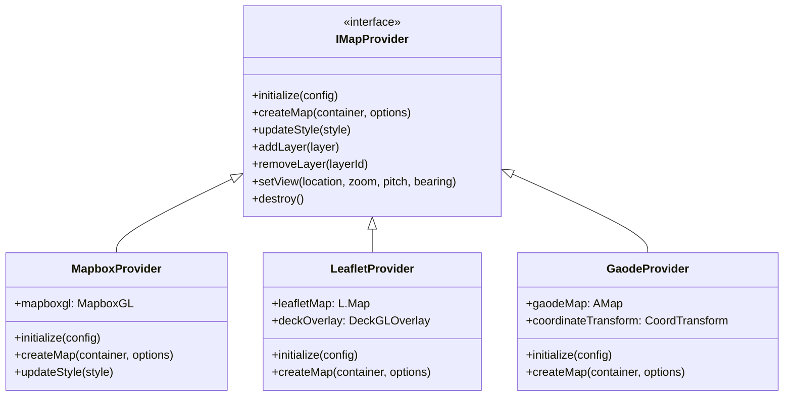

# Design Document

## Overview

This design document outlines the architecture for extending the mapdeck R package to support multiple mapping APIs and introduce advanced spatial sampling capabilities. The solution maintains backward compatibility while providing a flexible, provider-agnostic interface that supports Mapbox GL JS, Leaflet, OpenLayers, Chinese mapping services (Gaode/AutoNavi, Baidu), and GPU-accelerated spatial sampling functions.

The design follows a modular architecture with clear separation of concerns between map providers, deck.gl visualization layers, and spatial analysis functions. This approach ensures maintainability, extensibility, and optimal performance across different mapping backends.

## Architecture

### High-Level Architecture

```mermaid
graph TB
    subgraph "R Interface Layer"
        A[mapdeck() function]
        B[Provider Selection]
        C[Token Management]
        D[Spatial Sampling API]
    end
    
    subgraph "Provider Abstraction Layer"
        E[Provider Factory]
        F[Provider Interface]
        G[Mapbox Provider]
        H[Leaflet Provider]
        I[OpenLayers Provider]
        J[Gaode Provider]
        K[Baidu Provider]
    end
    
    subgraph "Core Services"
        L[Coordinate Transform Service]
        M[Style Management Service]
        N[Token Storage Service]
        O[Spatial Sampling Engine]
    end
    
    subgraph "JavaScript Layer"
        P[Provider-specific JS Adapters]
        Q[Deck.gl Integration]
        R[GPU Compute Shaders]
        S[WebGL Spatial Operations]
    end
    
    subgraph "External APIs"
        T[Mapbox GL JS]
        U[Leaflet.js]
        V[OpenLayers]
        W[Gaode Maps API]
        X[Baidu Maps API]
    end
    
    A --> B
    B --> E
    E --> F
    F --> G
    F --> H
    F --> I
    F --> J
    F --> K
    
    G --> T
    H --> U
    I --> V
    J --> W
    K --> X
    
    C --> N
    D --> O
    O --> R
    O --> S
    
    P --> Q
    Q --> R
    Q --> S
```

### Provider Architecture

The provider system uses a factory pattern with a common interface that all map providers must implement. This ensures consistent behavior across different mapping backends while allowing provider-specific optimizations.



## Components and Interfaces

### 1. Provider Factory and Registry

**Purpose:** Manages the creation and registration of map providers.

**Key Components:**
- `ProviderFactory`: Creates provider instances based on type
- `ProviderRegistry`: Maintains available providers and their capabilities
- `ProviderConfig`: Stores provider-specific configuration

**R Interface:**
```r
# Provider registration and factory
register_provider <- function(name, provider_class, capabilities)
create_provider <- function(provider_name, config)
get_provider_capabilities <- function(provider_name)
```

### 2. Token Management System

**Purpose:** Unified authentication and API key management across providers.

**Key Components:**
- `TokenStore`: Secure storage for API keys and tokens
- `TokenValidator`: Validates tokens for specific providers
- `EnvironmentTokenLoader`: Loads tokens from environment variables

**R Interface:**
```r
# Enhanced token management
set_token <- function(provider, token, scope = "default")
get_access_token <- function(provider, scope = "default")
list_tokens <- function()
validate_token <- function(provider, token)
```

### 3. Coordinate Transformation Service

**Purpose:** Handles coordinate system conversions, especially for Chinese mapping providers.

**Key Components:**
- `CoordinateTransformer`: Converts between WGS84, GCJ02, BD09 coordinate systems
- `ProjectionManager`: Manages map projections and transformations
- `BoundsConverter`: Transforms bounding boxes between coordinate systems

**R Interface:**
```r
# Coordinate transformation
transform_coordinates <- function(coords, from_crs, to_crs)
detect_coordinate_system <- function(data)
auto_transform <- function(data, target_provider)
```

### 4. Style Management System

**Purpose:** Provides provider-appropriate styles and themes.

**Key Components:**
- `StyleResolver`: Maps generic style names to provider-specific styles
- `StyleValidator`: Ensures style compatibility with providers
- `ThemeManager`: Manages consistent theming across providers

**R Interface:**
```r
# Enhanced style management
mapdeck_style <- function(style, provider = NULL)
get_available_styles <- function(provider)
create_custom_style <- function(provider, style_config)
```

### 5. Spatial Sampling Engine

**Purpose:** GPU-accelerated spatial sampling with administrative boundary support.

**Key Components:**
- `SamplingEngine`: Core sampling algorithms with GPU acceleration
- `AdministrativeSampler`: Specialized sampling within administrative boundaries
- `AllocationStrategy`: Different methods for distributing samples
- `ConcurrentProcessor`: Parallel processing for multiple regions

**R Interface:**
```r
# Spatial sampling functions
spatial_sample_administrative <- function(
  admin_polygons, 
  total_samples, 
  allocation_method = c("proportional", "equal", "custom"),
  concurrent = TRUE,
  use_gpu = TRUE
)

spatial_sample_random <- function(data, n, use_gpu = TRUE)
spatial_sample_stratified <- function(data, strata, n_per_stratum, use_gpu = TRUE)
```

## Data Models

### Provider Configuration Model

```r
ProviderConfig <- R6Class("ProviderConfig",
  public = list(
    name = NULL,
    type = NULL,
    authentication_required = NULL,
    supported_features = NULL,
    coordinate_system = NULL,
    default_style = NULL,
    
    initialize = function(name, type, auth_required, features, coord_sys, style) {
      self$name <- name
      self$type <- type
      self$authentication_required <- auth_required
      self$supported_features <- features
      self$coordinate_system <- coord_sys
      self$default_style <- style
    }
  )
)
```

### Sampling Configuration Model

```r
SamplingConfig <- R6Class("SamplingConfig",
  public = list(
    method = NULL,
    total_samples = NULL,
    allocation_strategy = NULL,
    concurrent = NULL,
    use_gpu = NULL,
    admin_column = NULL,
    weight_column = NULL,
    
    initialize = function(method, total_samples, allocation, concurrent, gpu, admin_col, weight_col) {
      self$method <- method
      self$total_samples <- total_samples
      self$allocation_strategy <- allocation
      self$concurrent <- concurrent
      self$use_gpu <- gpu
      self$admin_column <- admin_col
      self$weight_column <- weight_col
    }
  )
)
```

### Map State Model

```r
MapState <- R6Class("MapState",
  public = list(
    provider = NULL,
    layers = NULL,
    view_state = NULL,
    style = NULL,
    tokens = NULL,
    
    initialize = function() {
      self$layers <- list()
      self$view_state <- list(
        longitude = 0,
        latitude = 0,
        zoom = 0,
        pitch = 0,
        bearing = 0
      )
      self$tokens <- list()
    }
  )
)
```

## Error Handling

### Provider-Specific Error Handling

The system implements a hierarchical error handling strategy:

1. **Provider Validation Errors**: When invalid providers are specified
2. **Authentication Errors**: When API keys are missing or invalid
3. **Feature Compatibility Errors**: When unsupported features are used
4. **Coordinate System Errors**: When coordinate transformations fail
5. **GPU Processing Errors**: When GPU operations fail with CPU fallback

**Error Classes:**
```r
MapdeckProviderError <- function(message, provider, code) {
  structure(
    list(message = message, provider = provider, code = code),
    class = c("MapdeckProviderError", "error", "condition")
  )
}

SpatialSamplingError <- function(message, method, details) {
  structure(
    list(message = message, method = method, details = details),
    class = c("SpatialSamplingError", "error", "condition")
  )
}
```

## Testing Strategy

### Comprehensive Testing Requirements

All code must be thoroughly tested with complete test coverage and documented results. The testing framework will use `testthat` following R package standards.

### Unit Testing Strategy

1. **Provider Interface Testing**: Ensure all providers implement the required interface
   - Test files: `test-provider-interface.R`, `test-mapbox-provider.R`, `test-leaflet-provider.R`, `test-gaode-provider.R`, `test-baidu-provider.R`
   - Coverage requirement: 100% of provider interface methods
   - Expected results: All providers pass interface compliance tests

2. **Token Management Testing**: Verify secure storage and retrieval of API keys
   - Test files: `test-token-management.R`, `test-token-validation.R`
   - Coverage requirement: All token operations and edge cases
   - Expected results: Secure token storage, proper error handling for invalid tokens

3. **Coordinate Transformation Testing**: Test accuracy of coordinate conversions
   - Test files: `test-coordinate-transform.R`, `test-projection-accuracy.R`
   - Coverage requirement: All coordinate system combinations (WGS84, GCJ02, BD09)
   - Expected results: Transformation accuracy within 1 meter tolerance

4. **Sampling Algorithm Testing**: Validate spatial sampling correctness and performance
   - Test files: `test-spatial-sampling.R`, `test-administrative-sampling.R`, `test-gpu-sampling.R`
   - Coverage requirement: All sampling methods and allocation strategies
   - Expected results: Statistically valid sampling distributions, GPU performance gains >50%

5. **GPU Fallback Testing**: Ensure graceful degradation when GPU is unavailable
   - Test files: `test-gpu-fallback.R`
   - Coverage requirement: All GPU-dependent functions
   - Expected results: Seamless CPU fallback with performance warnings

### Integration Testing Strategy

1. **Cross-Provider Layer Testing**: Verify layers work consistently across providers
   - Test files: `test-cross-provider-layers.R`
   - Coverage requirement: All layer types on all providers
   - Expected results: Identical visual output across providers

2. **Performance Benchmarking**: Comprehensive performance testing with documented results
   - Test files: `test-performance-benchmarks.R`
   - Coverage requirement: All major operations (sampling, rendering, transformations)
   - Expected results: Performance baselines and regression detection

3. **Memory Usage Testing**: Monitor memory consumption during large dataset processing
   - Test files: `test-memory-usage.R`
   - Coverage requirement: Large dataset operations (>1M points)
   - Expected results: Memory usage within acceptable limits, no memory leaks

### Test Documentation Requirements

Each test file must include:
- Detailed test descriptions using `describe()` and `it()` patterns
- Performance benchmarks with `microbenchmark` package
- Memory profiling with `profmem` package
- Visual regression tests for map outputs
- Comprehensive edge case testing

## Code Documentation Standards

### R Package Documentation Requirements

All functions must follow roxygen2 documentation standards with complete parameter descriptions, examples, and return value specifications.

**Required Documentation Elements:**
1. **Function Description**: Clear, concise description of purpose
2. **Parameter Documentation**: `@param` for each parameter with type and description
3. **Return Value Documentation**: `@return` describing return type and structure
4. **Examples**: `@examples` with working code examples
5. **Export Declaration**: `@export` for public functions
6. **See Also**: `@seealso` for related functions
7. **Details**: `@details` for implementation specifics when needed

**Documentation Template:**
```r
#' Title of Function
#'
#' Detailed description of what the function does, including any important
#' implementation details or usage notes.
#'
#' @param param1 Description of parameter 1, including type and constraints
#' @param param2 Description of parameter 2, including default values
#' @param ... Additional parameters passed to underlying functions
#'
#' @return Description of return value, including type and structure
#'
#' @details Additional implementation details, algorithm descriptions,
#' or performance considerations.
#'
#' @examples
#' \donttest{
#' # Example 1: Basic usage
#' result <- function_name(param1 = "value", param2 = 123)
#' 
#' # Example 2: Advanced usage
#' advanced_result <- function_name(
#'   param1 = "advanced_value",
#'   param2 = 456,
#'   additional_param = TRUE
#' )
#' }
#'
#' @seealso \code{\link{related_function}}, \code{\link{another_function}}
#'
#' @export
function_name <- function(param1, param2, ...) {
  # Function implementation
}
```

## Code Modularization Strategy

### File Size Constraints

All code files must be limited to 500 lines maximum. This constraint will be enforced through:

1. **Functional Decomposition**: Breaking large functions into smaller, focused functions
2. **Module Separation**: Separating concerns into different files
3. **Utility Functions**: Creating shared utility files for common operations
4. **Provider-Specific Files**: Separate files for each map provider implementation

### Modular File Structure

All R source files must be directly in the `R/` directory as per R package standards. Files are organized with descriptive prefixes to maintain logical grouping:

```
R/
├── provider-interface.R              # Provider interface definition (< 200 lines)
├── provider-factory.R               # Provider factory and registry (< 300 lines)
├── provider-config.R                # Configuration management (< 250 lines)
├── provider-utils.R                 # Shared provider utilities (< 200 lines)
├── provider-mapbox.R                # Mapbox implementation (< 400 lines)
├── provider-leaflet.R               # Leaflet implementation (< 400 lines)
├── provider-openlayers.R            # OpenLayers implementation (< 400 lines)
├── provider-gaode.R                 # Gaode Maps implementation (< 400 lines)
├── provider-baidu.R                 # Baidu Maps implementation (< 400 lines)
├── token-store.R                    # Token storage operations (< 300 lines)
├── token-validation.R               # Token validation logic (< 200 lines)
├── token-utils.R                    # Token utility functions (< 150 lines)
├── coordinate-transformer.R         # Core transformation logic (< 400 lines)
├── coordinate-projection.R          # Projection management (< 300 lines)
├── coordinate-bounds.R              # Bounds transformation (< 200 lines)
├── spatial-sampling-engine.R        # Core sampling algorithms (< 450 lines)
├── spatial-sampling-admin.R         # Admin boundary sampling (< 400 lines)
├── spatial-sampling-allocation.R    # Sample allocation methods (< 300 lines)
├── spatial-sampling-concurrent.R    # Parallel processing (< 350 lines)
├── spatial-sampling-gpu.R           # GPU acceleration utilities (< 300 lines)
├── style-resolver.R                 # Style resolution logic (< 250 lines)
├── style-validator.R                # Style validation (< 200 lines)
├── style-theme.R                    # Theme management (< 200 lines)
├── error-handling.R                 # Error classes and handlers (< 200 lines)
├── validation-utils.R               # Input validation utilities (< 250 lines)
└── performance-utils.R              # Performance monitoring (< 200 lines)
```

### Code Quality Standards

1. **Function Length**: Maximum 50 lines per function
2. **Cyclomatic Complexity**: Maximum complexity of 10 per function
3. **Code Comments**: Minimum 20% comment-to-code ratio
4. **Naming Conventions**: Use snake_case for functions and variables
5. **Error Handling**: All functions must include proper error handling
6. **Input Validation**: All public functions must validate inputs

The modular design ensures maintainability, testability, and adherence to R package development best practices while keeping individual files manageable and focused.